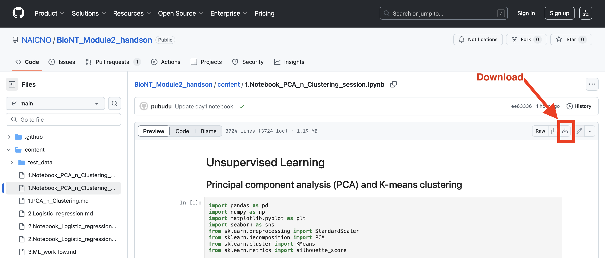

# Unsupervised Learning

## Principal component analysis (PCA) and K-means clustering

:::{prereq}

* BioNT Applied Machine Learning for Biological Data
  * Module 1: Python Numpy and Pandas
  * Module 2: Unsupervised Learning: Clustering (K-Means Clustering, Hierarchical clustering, Clustering evaluation metrics)

*Participants should gain skills introduced in above mentioned Lessons or equivalent skills.*

:::

:::{exercise} Time
2 hours and 30 minutes
:::

:::{objectives}

## Objectives

* Demonstrate the use of unsupervised learning for drug sensitivity analysis.
* Example workflow of PCA and K-means clustering with test dataset (drug sensitivity patterns across patients) for patient stratification
:::

## Dataset

* Imputed Drug Sensitivities:
  * This data was imputed for TCGA-BRCA patients based on a model trained on cancer cell line gene expression and corresponding in vitro drug response measurements
* Source: [Cancer drug sensitivity prediction from routine histology images](https://www.nature.com/articles/s41698-023-00491-9)

*[download test dataset](test_data/pca_clustering/BRCA_Drug_sensitivity_test_data.csv)*

## Notebook

* [Download the notebook](https://github.com/NAICNO/BioNT_Module2_handson/blob/main/content/1.Notebook_PCA_n_Clustering_session.ipynb)

