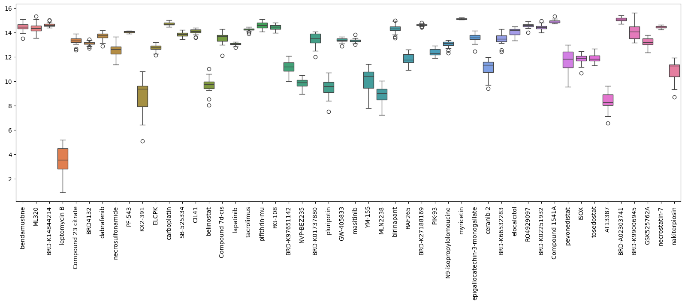
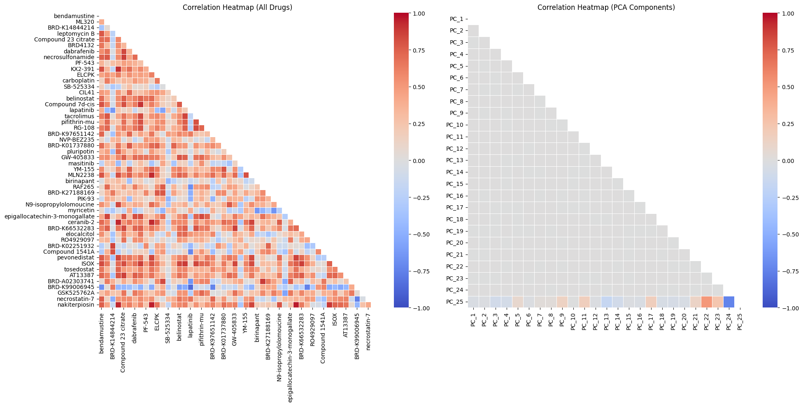
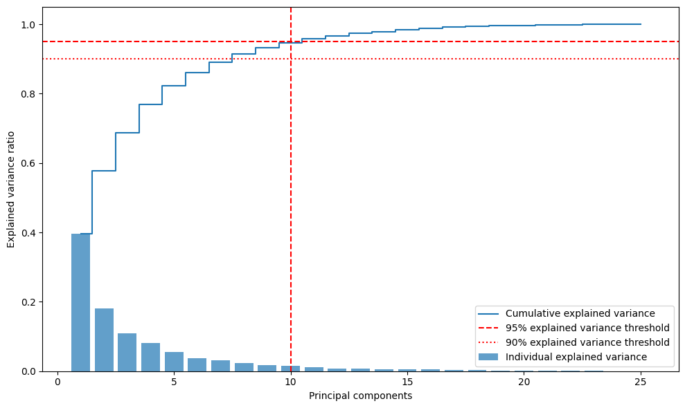
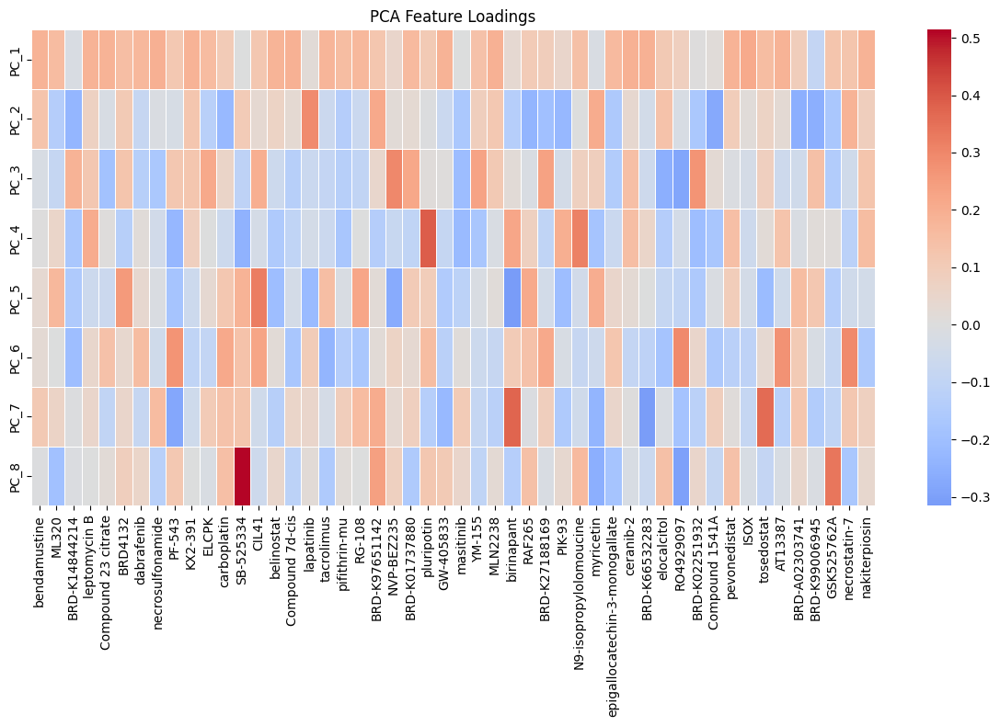

# Unsupervised Learning

## Q & A session: Principal component analysis (PCA) and K-means clustering

:::{instructor-note}

- Participants were given 45-60 minutes to
  - go through the Jupter notebook and
  - select correct answers for the questions
- Instructor narrate the answers and reasoning after the self-study time
  - time: 30 minutes
:::

### Dimensionality of the datasets

:::{questions}

**Question 1:**

You have a dataset with 50 columns (drug compounds) and 25 rows (patients). Is this dataset considered high-dimensional?

- A) No, because 50 columns is not a large number
- B) No, because the dataset is too small overall
- C) Yes, because there are more features (50) than samples (25)
- D) Yes, because 25 patients is insufficient for any analysis

**Question 2:**

Why is your dataset with 50 drug compounds and 25 patients considered high-dimensional?

- A) Because 50 is the threshold for high-dimensionality
- B) Because the number of features (50) significantly exceeds the number of samples (25)
- C) Because drug compound data is inherently high-dimensional
- D) Because 25 patients represent too many medical conditions

**Question 3:**

In your dataset, the ratio of features to samples is 2:1 (50 features to 25 samples). This high-dimensional characteristic is most likely to cause:

- A) Faster model training due to more information per patient
- B) Better generalization because of the rich feature space
- C) The "curse of dimensionality" and potential overfitting issues
- D) Automatic feature selection by machine learning algorithms
:::

### Standardization

:::{questions}

**Before (A) / After standardization plots (B):**

A.

B.

**Question 1: Scale Uniformity After Standardization:**

Comparing the original drug sensitivity scores (A) with the standardized versions (B), what is the most important change for PCA analysis?

- A) The standardized data has fewer outliers than the original data
- B) All drug compounds now have similar scales (roughly -3 to +3) instead of vastly different ranges
- C) The standardized data shows stronger correlations between compounds
- D) The standardized data has reduced the total number of features

**Question 2: PCA Component Interpretation:**

After standardization, all drug compounds now have approximately the same variance. How will this affect your PCA results compared to using the original unstandardized data?

- A) PC1 will still be dominated by the originally high-variance compounds like leptoporin B
- B) PCA components will now reflect actual biological/chemical relationships rather than just scale differences
- C) PCA will find fewer meaningful components due to the uniform scaling
- D) The explained variance percentages will be identical to the unstandardized analysis

**Question 3: Practical PCA Decision:**

You're about to perform PCA for drug discovery research. Based on your standardization comparison, which approach would give you more interpretable principal components for identifying drug response patterns?

- A) Use original data because it preserves the natural measurement scales of each drug
- B) Use standardized data because it allows PCA to focus on underlying biological patterns rather than measurement scale artifacts
- C) It doesn't matter - PCA will automatically handle scale differences
- D) Use original data because standardization removes important variance information

**Question 4:  Variance Landscape:**

Looking at your standardized data plot where all compounds now have similar variance, what does this mean for PCA's search for "maximum variance directions"?

- A) PCA will no longer work because there's no variance to capture
- B) PCA will now find directions based on correlations and biological patterns rather than being biased by high-variance features
- C) PCA will randomly select components since all variances are equal
- D) PCA will focus only on outlier detection

:::

### Apply PCA transformation

:::{questions}

**Question 1:**

Comparing the two heatmaps, what is the most significant difference between the correlation patterns of the original drug compounds (left) and the PCA components (right)?

- A) The PCA components show stronger correlations than the original compounds
- B) The original compounds are uncorrelated while PCA components are highly correlated
- C) The original compounds show various correlation patterns, while PCA components are essentially uncorrelated (orthogonal)
- D) Both heatmaps show identical correlation structures

**Question 2:**

In your PCA components heatmap (right), most correlations appear to be near zero (gray/white). This pattern demonstrates which fundamental property of PCA?

- A) PCA randomly shuffles the original correlations
- B) PCA creates principal components that are orthogonal (perpendicular) to each other, eliminating correlation
- C) PCA amplifies the strongest correlations from the original data
- D) PCA preserves all original correlation relationships between features

**Question 3:**

The original drug compounds heatmap shows clusters of correlated compounds (red blocks), while the PCA heatmap is predominantly gray. What does this tell you about what PCA has accomplished?

- A) PCA has lost important information about drug relationships
- B) PCA has transformed the correlated original features into a new set of uncorrelated components that still capture the data's variance
- C) PCA has created random noise instead of meaningful components
- D) PCA has made the data analysis more complicated

:::

### Explained variance ratios

:::{questions}

**Question 1:**

Your plot shows that 10 principal components explain 95% of the total variance (red dashed line). For a machine learning application, which approach would be most appropriate?

- A) Always use all 25 components to avoid losing any information
- B) Use exactly 10 components because they reach the 95% threshold
- C) Use only PC1 since it explains the most variance (40%)
- D) Choose the number of components based on your specific analysis goals and computational constraints

**Question 2:**

Examining the individual explained variance bars (blue), there's a sharp drop after PC1 and PC2, then the contributions become much smaller. This pattern suggests:

- A) The first two components capture the main data structure, while next ffew components may represent minor patterns and last few components represent noise 
- B) Only PC1 and PC2 are mathematically valid
- C) Components 3-25 contain no useful information
- D) This indicates an error in the PCA calculation

**Question 3:**

In the context of your drug sensitivity dataset, what does PC1's 40% explained variance represent biologically?

- A) 40% of the drugs are important for the analysis
- B) The first principal component captures a major pattern of drug response variation across patients that accounts for 40% of the total variability
- C) 40% of the patients respond similarly to drugs
- D) 60% of the data is noise and should be discarded
:::

### Generate scree plot

:::{questions}

**Question 1:**

In your scree plot, the eigenvalues drop sharply from PC1 (~21) to PC2 (~9) to PC3 (~6), then gradually flatten out after PC6-7. What is the logic behind choosing the number of components at the "elbow" point where the curve starts to flatten?

- A) Components after the elbow contain no mathematical information
- B) Components before the elbow capture major data patterns, while those after the elbow likely represent noise or minor variations
- C) The elbow point is randomly determined and has no statistical meaning
- D) You should always choose exactly at the steepest drop point

**Question 2:**

Looking at your scree plot, why do we typically avoid including principal components from the flat region (PC8 onwards, where eigenvalues are close to 0)?

- A) These components are mathematically incorrect and will cause errors
- B) These components represent very small amounts of variance and may capture noise rather than meaningful signal
- C) These components take too much computational time to calculate
- D) These components are always highly correlated with the first few components

:::

### Interpretation and Analysis

:::{questions}

**Question 1:**

In this PCA loadings heatmap, some drug compounds show dark red or dark blue colors while others appear white/gray. What do these color intensities tell you about each compound's contribution to the principal components?

- A) Dark colors indicate drugs that are more effective therapeutically
- B) Dark red/blue indicate high absolute loading values, meaning these compounds strongly contribute to defining that principal component
- C) White/gray areas indicate missing data for those drug compounds
- D) Color intensity represents the correlation between different drugs

**Question 2:**

Looking at PC1 (top row), you can see both red (positive) and blue (negative) loadings for different drug compounds. What does this pattern of positive and negative loadings indicate?

- A) Positive loadings are "good" drugs and negative loadings are "bad" drugs
- B) This indicates an error in the PCA calculation since all loadings should be positive
- C) Compounds with positive loadings move in the same direction as PC1, while those with negative loadings move in the opposite direction
- D) Positive and negative loadings cancel each other out, making PC1 meaningless

**Question 3:**

To understand what PC1 represents biologically in your drug sensitivity study, which compounds should you focus on for interpretation?

- A) Only the compounds with positive loadings (red colors)
- B) Only the compounds with negative loadings (blue colors)
- C) The compounds with the highest absolute loadings (darker shades of red and blue), regardless of sign
- D) The compounds with near-zero loadings (white/gray) because they're most stable

**Question 4:**

If you wanted to name or characterize what biological pathway PC1 represents, how would you use the loading information?

- A) Look up the biological functions of compounds with the highest absolute loadings in PC1
- B) Only consider the single compound with the highest positive loading
- C) Average all the loading values to get a general interpretation
- D) Focus on compounds that appear in multiple principal components

:::
