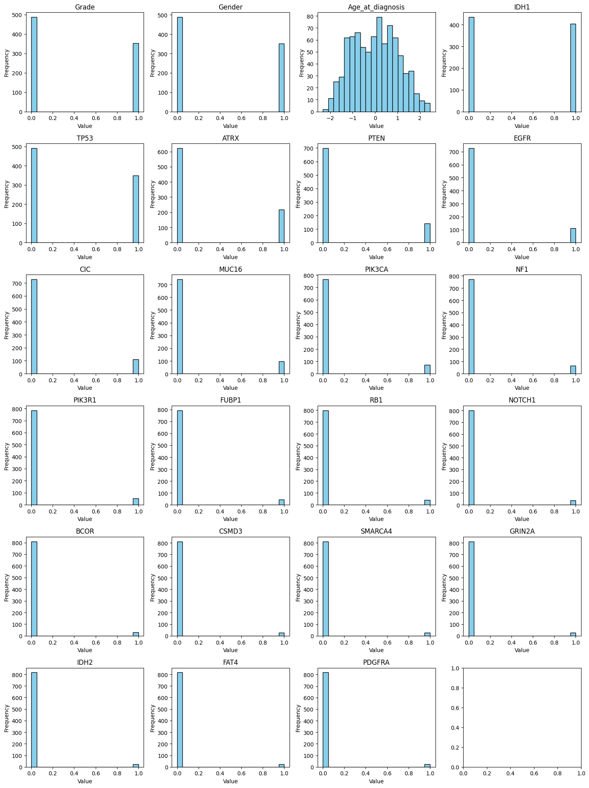
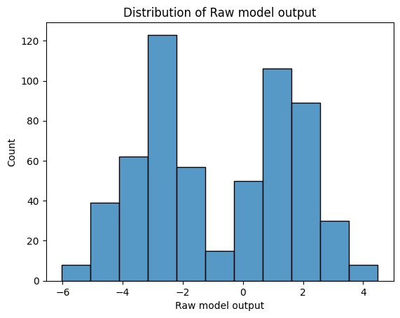
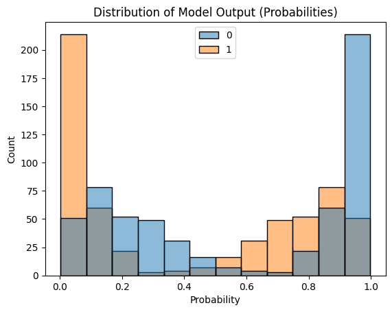
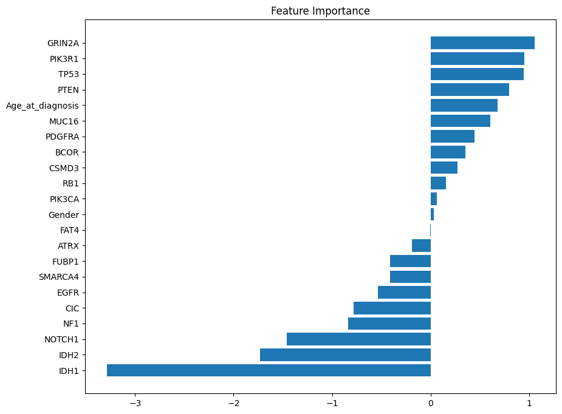
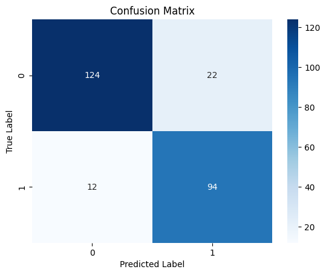

# Classification

## Q & A session: Logistic regression

:::{instructor-note}

- Participants were given 30 minutes to
  - go through the Jupter notebook and
  - select correct answers for the questions
- Instructor narrate the answers and reasoning after the self-study time
  - time: 30 minutes
:::

### Understanding biological context (ML-use case)

:::{questions}

**Question 1:**

What type of machine learning problem is glioma grading/classification as described in this tutorial?

- A) Unsupervised clustering problem
- B) Binary classification problem
- C) Multi-class classification problem
- D) Regression problem

**Question 2:**

In this study, how is the target variable encoded?

- A) LGG = 1, GBM = 0
- B) LGG = 0, GBM = 1
- C) Both are encoded as 1
- D) Text labels are used without numeric encoding
Answer: - B) LGG = 0, GBM = 1
Explanation: The target variable encoding is explicitly stated as 0 = "LGG" and 1 = "GBM".

**Question 3:**

What types of features are being used in this logistic regression model?

- A) Only genetic mutation data
- B) Only clinical features
- C) 20 most frequently mutated genes plus 3 clinical features
- D) All available genetic and clinical data

**Question 4:**

Why is accurate glioma grading/classification clinically important?

- A) It determines the research funding allocation
- B) Different grades require different treatment approaches and have different prognoses
- C) It's only important for statistical purposes
- D) It helps organize hospital records

:::

### Visualize data distributions

:::{questions}

**Question 1:**

Binary features (keeping them as 0/1) while scaling Age_at_diagnosis. What is the primary reason why scaling binary features is generally NOT recommended in logistic regression?

- A) Binary features are too simple to benefit from scaling
- B) Scaling binary features would destroy their natural interpretability - coefficients would no longer represent the change from "absent" (0) to "present" (1)
- C) Binary features automatically have equal variance, so scaling is unnecessary
- D) Logistic regression algorithms cannot handle scaled binary features

**Question 2:**

Given the heavy imbalance in most binary features (with most values being 0 and small number of observations with 1s'), what potential issue might this create during logistic regression training?

- A) The model will converge faster due to the simplicity of the data
- B) The model may have difficulty learning meaningful patterns from rare events (1s) and might be biased toward predicting the majority class
- C) The imbalanced features will automatically be weighted equally by the algorithm

**Question 3:**

When interpreting logistic regression coefficients for the heavily imbalanced binary features shown in these plots, what should you be particularly cautious about?

- A) Coefficients for rare events may be unstable and can lead to poor generalization
- B) Coefficients will be automatically adjusted by the algorithm to account for imbalance
- C) Imbalanced features always produce more reliable coefficient estimates
- D) The scaling of Age_at_diagnosis will make other coefficients uninterpretable

:::
### Split original dataset

:::{questions}

**Question 1:**

In the `train_test_split` code, `test_size=0.3` means 30% of data goes to testing. For a medical dataset like glioma classification, what is the primary consideration when choosing this split ratio?

- A) Larger test sets always give better model performance
- B) Balancing reliable performance evaluation with sufficient training data, especially important given limited medical data availability
- C) Test size should always be exactly 30% regardless of dataset characteristics
- D) Smaller test sets are always preferred to maximize training data

**Question 2:**

In the `train_test_split` code, why is the `stratify=gliomas["Grade"]` parameter crucial in this glioma classification problem?

- A) It randomly shuffles the data for better performance
- B) It ensures both training and test sets have proportional representation of LGG and GBM cases
- C) It sorts the data by grade for easier processing
- D) It removes outliers from the dataset

:::

### The Model Output (Probability)

:::{questions}

**Question 1:**

The histogram shows a distinctive U-shaped distribution of predicted probabilities, with many predictions clustered near 0.0 and 1.0, and fewer predictions in the middle range (0.3-0.7). What does this pattern indicate about the model's behavior?

- A) The model is making unreliable predictions
- B) The model is well-calibrated and confident in most of its predictions, clearly separating the two classes
- C) The model has failed to converge properly during training
- D) The sigmoid transformation is not working correctly

**Question 2:**
What does lr.predict_proba(X_test) output, and why are probability predictions particularly valuable in medical diagnosis like glioma classification?

- A) It outputs only the predicted class labels (0 for LGG, 1 for GBM)
- B) It outputs probability estimates for each class (P(LGG) and P(GBM)) for each patient, allowing clinicians to assess prediction confidence
- C) It outputs the raw coefficient values for each gene and clinical feature
- D) It outputs the training accuracy of the model

:::

### Predict test-datasaets

:::{questions}

**Question 1:**

What is the key difference between `lr.predict(X_test)` and lr.predict_proba(X_test) in this glioma classification model?

- A) `predict() `gives probabilities for each class, while `predict_proba()` gives final class labels
- B) `predict()` gives final class decisions (0 for LGG, 1 for GBM) by applying a 0.5 threshold to probabilities, while `predict_proba()` gives the actual probability values
- C) `predict()` is more accurate than `predict_proba()`
- D) There is no difference between the two methods

:::

### Examine and understand the importance of features in predicting classes

:::{questions}

**Question 1 (Coefficient Sign Interpretation):**

In this glioma classification model, what does a positive coefficient in `lr.coef_` indicate for a specific gene or clinical feature?

- A) The feature has no effect on glioma classification
- B) The feature increases the likelihood of predicting GBM (class 1) when present or higher in value
- C) The feature increases the likelihood of predicting LGG (class 0) when present or higher in value
- D) The feature should be removed from the model

**Question 2 (Coefficient Sign Interpretation):**

Looking at the feature importance plot, what can you conclude about the features GRIN2A (rightmost bar) and IDH1 (leftmost bar) in terms of their effect on the predicted outcome?

- A) GRIN2A decreases the probability of the positive class, while IDH1 increases it
- B) GRIN2A increases the probability of the positive class, while IDH1 decreases it
- C) Both features have the same effect but different magnitudes
- D) The sign of the coefficient doesn't matter, only the magnitude

:::

### Evaluation of the model performance

:::{questions}

**Question 1:**

Based on the confusion matrix shown, what are the True Positives, False Positives, True Negatives, and False Negatives for this glioma classification model?

- A) TP=124, FP=22, TN=94, FN=12
- B) TP=94, FP=22, TN=124, FN=12
- C) TP=22, FP=94, TN=12, FN=124
- D) TP=94, FP=12, TN=124, FN=22

:::
