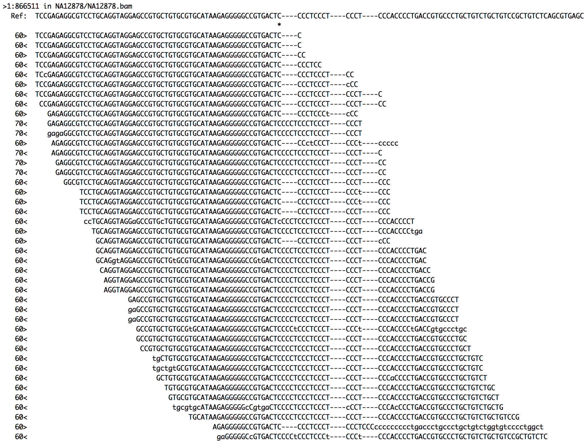
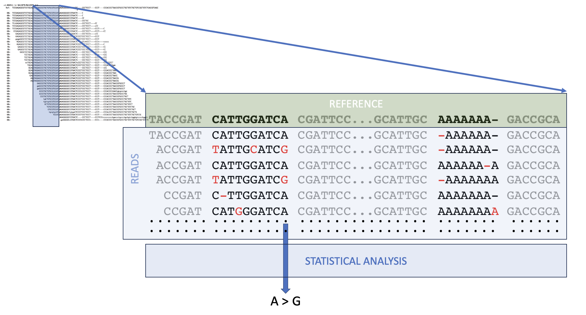
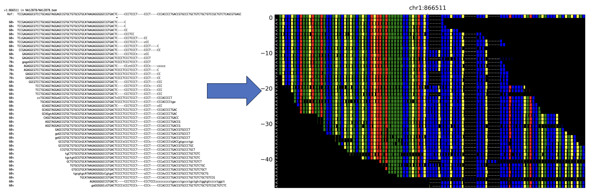
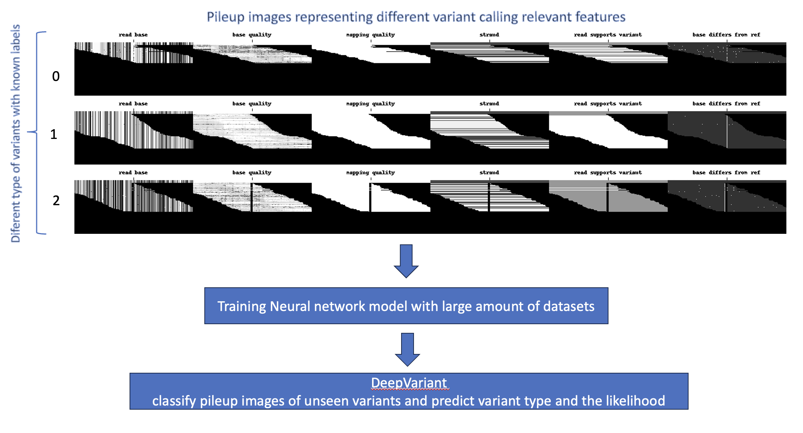
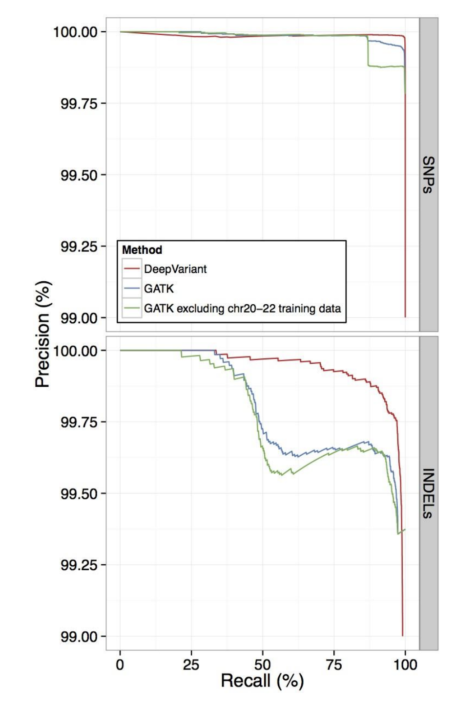
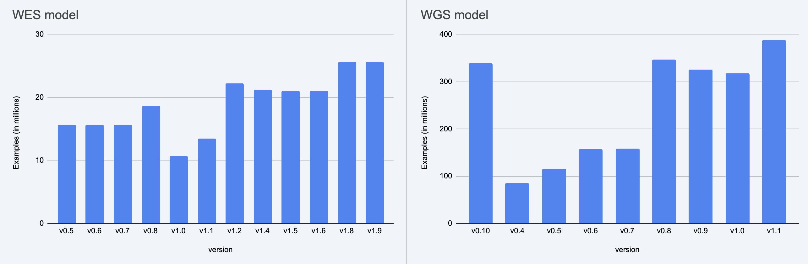
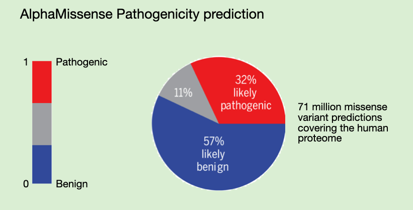
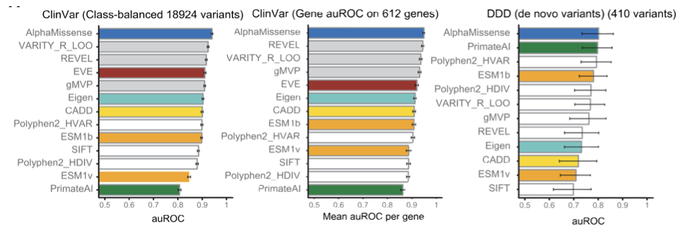

# DeepVariant: Deep-learning tool

:::{exercise} Time
- Lecture: 20 minutes
- Exercise: 10 mins
- hands-on: 30 mins
:::

:::{objectives}
- We will introduce two such tools used in variant calling and functional effect prediction
  - DeepVariant: Live session
  - AlphaMissense (Additional notes, not intended to cover in live session)
:::

## Variant calling

- Variant calling is the process of identifying of variants from sequence data
  - Compare the sequence data from an individual to a reference genome to identify differences


[*Source*](https://www.genome.gov/about-genomics/educational-resources/fact-sheets/human-genomic-variation)

### Data preprocessing steps for variant calling

- Will be discussed in detail on Day-5 sessions

### Main input for variant calling

- Alignment file used can be think of as a dataset representing sequence reads that are aligned to a reference genome - i.e., sequence reads are pileup along the reference genome



[*Source*](https://campuspress.yale.edu/knightlab/ruddle/plotreads/)

## Standard variant calling tools

Standard variant calling tools are based on statistical models and various QC parameters

- These tools first analyze alignment files to detect read-positions that differ from reference

- Apply statistical methods combining various information (nucleotide and QC parameters) of these read-positions to identify genomic variants



```bash
#Run Haplotype Caller
$ gatk HaplotypeCaller \
    --java-options -Xmx30g \
    --input ${INPUT_BAM} \
    --output ${OUT_VCF} \
    --reference ${REFERENCE} \
    --native-pair-hmm-threads ${CPU}
```

## Deep learning based variant caller - DeepVariant

- Various visualization techniques have been used to validate regions of alignment files with variants (e.g., Pileup-images)



- DeepVariant leverages this concept of pileup-images to visualize not only the bases, but other features that are important for variant calling
  - DeepVariant generates sets of images for candidate variant positions representing range of features
  - Stack of pileup images each representing
    - Base calling quality
    - Mapping quality
    - Metadata on where position is reference or not
    - etc...
- Availability of these images transform variant calling a image classification problem
- DeepVariant use deep-learning model to classify these images and predict variants with high precision



## DeepVariant vs traditional variant callers

- DeepVariant showed higher Precision and sensitivity scores compared traditional callers (Ref: [Original DeepVariant](https://www.nature.com/articles/nbt.4235) paper and [Independent studies](https://bmcgenomics.biomedcentral.com/articles/10.1186/s12864-022-08365-3/tables/3))

:::{solution} Precision vs Recall plot

:::

- High accuracy of DeepVariant compared to traditional callers:
  - DeepVariant won 2020 PrecisionFDA Truth Challenge V2 for all Benchmark Regions across Multiple sequencing Technologies
  - DeepVariant - best SNP Performance in 2016 PrecisionFDA Truth Challenge
  - DeepVariant makes a great difference especially for low coverage samples
  - [References are linked in DeepVariant GitHub repo](https://github.com/google/deepvariant)

:::{exercise}
Why deep-learning based (DeepVariants) could out-performed traditional methods?
:::

### DeepVariant model training and evaluation

- This training dataset consist of 100s of millions of samples from multiple genomes, sequencers, and preparation methods
- This help minimize the bias in the model towards a specific sequencing platform or technology

:::{solution} DeepVariant training data

[Ref: DeepVariant training data](https://github.com/google/deepvariant/blob/r1.9/docs/deepvariant-details-training-data.md)
:::

- Model is evaluated using unseen data from [precisionFDA Truth Challenge](https://precision.fda.gov/challenges/truth/results

:::{note}
## Hands-on: DeepVariant run

- Log into VM following instructions given in previous session

:::{instructor-note} Run inside the VM

```bash
# Move to home directory
cd $HOME

# Check your current working directory (you'll see e.g., /home/biont*)
pwd

# Run docker interactive mode
docker run \
-it \
--rm \
--gpus all \
-v /data:/data \
-v $PWD:$PWD \
-w $PWD \
nvcr.io/nvidia/clara/clara-parabricks:4.3.0-1 bash
```

:::{instructor-note} Now you are inside the docker container

```bash
# Set path variable (i.e, copy following lines)

FASTA="/data/ngs/ref/Homo_sapiens_assembly38.fasta"
KNOWN_SITES="/data/ngs/ref/Homo_sapiens_assembly38.known_indels.vcf.gz"
BAM=/data/ngs/BAM/dw_sample.bam

# Run DV command & generate deepvariant.vcf output file (i.e, copy following lines)
pbrun deepvariant --ref ${FASTA} \
--in-bam ${BAM} \
--num-gpus 1 \
--logfile dv.log \
--out-variants deepvariant.vcf

## You can exit the docker with `exit` command
```

:::
:::
:::
- Inspect the DeepVariant output `deepvariant.vcf`

:::{instructor-note} AlphaMissense
<details>
<summary>AlphaMissense notes:</summary>

- One of the main goals of variant calling is to evaluating the clinical significance of detected variants
- Can we use ML to evaluate the clinical significance of variants?

### Pathogenicity prediction (predicting damaging effects) of variants

- Pathogenicity prediction is the process of determining the clinical significance of a variant
  - Pathogenic variants are those that cause a disease
  - Benign variants are those that do not cause or are not associated with a disease
- Current methods developed to reach above goal rely on combining following two fields
  - knowledge of genetics and the biological processes - evolutionary conservation, protein structure, etc
  - statistical methods
- For instance, variants that are

- common in the population are less likely to have damaging effects (benign)
- rare and run in families with disease are more likely to be pathogenic
- highly conserved across species are more likely to be pathogenic
- affecting (altering) the structure of proteins critical for cellular functions are more likely to be pathogenic

## Main challenge

- Over the years, scientists have identified a long list of disease associated genes
- A large number of variants in these genes alters the protein sequence (amino acid sequence), but exact impact of on the protein structure is still unknown. Thus, association with the disease is also unknown
  - Such variants are known variants with uncertain significance
  - According to a recent study a **large majority of such variants (that alter protein sequence - missense) are with uncertain significance** - [source](https://www.ncbi.nlm.nih.gov/pmc/articles/PMC7334197)
  - Differentiating pathogenic and bening such variants is a challenging task

## Deep-learning based solution - AlphaMissense

- Deep-learning model predicting the (missense) variant pathogenicity
- Ref: https://www.science.org/doi/10.1126/science.adg7492


`Source: <https://www.science.org/doi/10.1126/science.adg7492>`__

**Main steps**:

1. Collecting and processing a large dataset of missense variants along with annotations indicating their pathogenicity (disease-causing or benign)

2. Convert variant info and amino acid sequences into representations suitable for deep learning models

    - Transform raw data into new features that can better represent the underlying patterns and relationships

    

    `Source: <https://www.science.org/doi/10.1126/science.adg7492>`__

3. Fine-tune AlphaFold deep-learning model that predicts protein structure to predict variant pathogenicity
4. Assess the accuracy and generalizability of variant pathogenicity prediction using independent datasets

### AlphaMissense model training

- Training data:
  - Bening: missense variants frequently observed in human and primate populations
  - Pathogenic: missense variants absent from human and primate populations
- Validation data:
  - Tune model parameters
  - Held-out data
    - Pathogenic missense variants in various databases
    - Bening variants from population-databases

- Test data:
  - Evaluate the model’s performance on unseen data
  - Held-out data
  - Pathogenic missense variants in ClinVar
  - Bening variants from population-databases

### Model evaluation

- Model evaluation ensures that the model’s performance is not biased by the training data and that it can generalize to new and unseen variants
- Predict the pathogenicity of each variant in the independent dataset (variants not included in the training dataset)

- AlphaMissense model is evaluated using multiple clinical benchmark datasets
  - `ClinVar` test set,
  - `De novo variants` from rare disease patients,


`Source: <https://www.science.org/doi/10.1126/science.adg7492>`__

### Applications

- AlphaMissense findings coupled with downstream functional experiments improve the current understanding of clinically actionable genes and variants
- Improve the diagnostic yield of rare genetic diseases

</details>
:::
